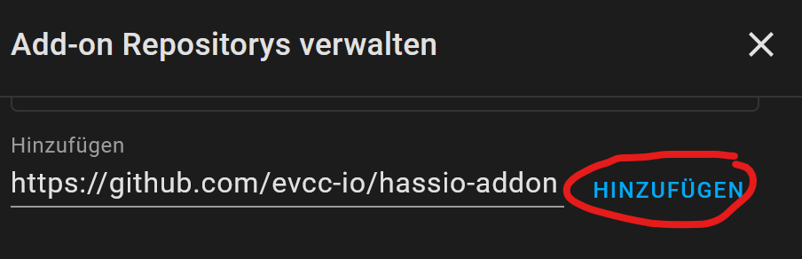
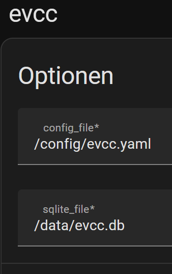

# evcc-hassio-addon
evcc Add-on for Home Assistant OS

# Installation

Follow these steps to get the add-on installed on your system:

  - Navigate in your Home Assistant frontend to Supervisor -> Add-on Store.
  
    
  
  - Click -> Add-on Store.
  
    
  
  - Click -> three dots -> Repositories.
   
    
  
  - Click -> three dots -> Repositories.
  
    
  
  - Copy "https://github.com/evcc-io/hassio-addon" Click -> Add
  
  - Reload the WebSite (CTRL+R or CTRL+F5 or CTRL+Fn+F5)
  - Find the "evcc" add-on and click it.
  - Click on the "INSTALL" button.
  - Go to Information nenu in the "evcc" Addon and activate "show in side bar"
    (evcc UI  `http://your-ha-instance-ip-address:7070`)
  - Go to Configuration menu and select your working directory (example):
  
    

        - config_file: /config/evcc.yaml
        - sqlite_file: /data/evcc.db

    
  - evcc configuration file evcc.yaml
      - Copy https://github.com/evcc-io/evcc/blob/master/evcc.dist.yaml to your homeassistant/config/ directory
      - Rename  evcc.dist.yaml to evcc.yaml (note: configure first to your needs the evcc.yaml or use a working configuration)
        
        Location of "config" directroy in HA:
        - https://www.home-assistant.io/docs/configuration/
        - https://www.home-assistant.io/common-tasks/os/#installing-and-using-the-samba-add-on

# !! NOTE !!

The Home Assistant Addon evcc is based on docker, there is no possibility to create a configuration file for evcc inside the evcc docker with "evcc configure"!

As a result of this a working evcc configuration is required. 

To do this, perform the steps in the documentation of evcc to create a configuration file "evcc.yaml":

  - https://docs.evcc.io/docs/installation/manual

# Configuration of [evcc](https://github.com/evcc-io/evcc)

   - https://docs.evcc.io/docs/guides/setup
