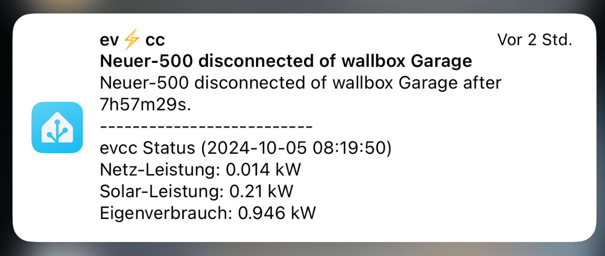

# evcc 🚘☀️ Home Assistant Addon

> [!NOTE]
>This guide is aimed for users running Home Assistant. Of course it is possible to run EVCC outside Home Assistant too, but as is has a very low footprint running EVCC as an
>Addon is the simplest ways.

## Installation Guide

1. Click -> Add-on Store under Settings - Addons.
2. Click -> three dots -> Repositories.
3. Copy https://github.com/evcc-io/hassio-addon Click -> Add
4. Reload the WebSite (CTRL+R or CTRL+F5 or CTRL+Fn+F5)
5. Find the "evcc" add-on and click it.
6. Click on the "INSTALL" button.

### Configuration

Go to Information menu in the "evcc" Addon and activate "show in side bar" (evcc UI http://your-ha-instance-ip-address:7070)

Go to Configuration menu and select your working directory (example):
<!---
<Screenshot
  name="screenshots/ha_configuration_ui"
  caption="Screenshot der Arbeitsverzeichnisse und Dateinamen in der Konfiguration."
/>
--->
<!---
> [!IMPORTANT]
>
> **This config will be deprecated soon.**
>
> If your evcc.db is in folder /data/evcc.db you don´t have to change the db location, but it is recomended. -> [How to find my evcc.db](https://github.com/evcc-io/hassio-addon/edit/main/README.md#how-to-find-and-copy-dataevccdb)
>
--->

```sh
- config_file: /config/evcc.yaml
- sqlite_file: /data/evcc.db
```
<!---
#### New file location (not active yet)
> [!WARNING]
>
> **If your evcc.yaml and evcc.db is in Home Assistant Addon Config folder, you have to configure following.**
> 
> First copy your evcc.db and evcc.yaml to /config ( maps to addon_configs/49686a9f_evcc/ ) -> [How to find my evcc.db](https://github.com/evcc-io/hassio-addon/edit/main/README.md#how-to-find-and-copy-dataevccdb)
>```sh
>- config_file: /config/evcc.yaml
>- sqlite_file: /config/evcc.db
>```
#### New alternative file location (not active yet)
> [!WARNING]
>
> **If your evcc.yaml and evcc.db is in Home Assistant root configuration folder, you have to configure following.**
>
> First copy your evcc.db and evcc.yaml to Home Assistant root configuration folder -> [How to find my evcc.db](https://github.com/evcc-io/hassio-addon/edit/main/README.md#how-to-find-and-copy-dataevccdb)
>```sh
>- config_file: /homeassistant/evcc.yaml
>- sqlite_file: /homeassistant/evcc.db
>```

> [!IMPORTANT]
>
> What will change:
> 
> /config (from /config in Home Assistant OS to /addon_configs/`<slug>`_evcc)
> 
> /homeassitant (will replace /config in Add On Container and maps to Home Assistant root configuration folder /config) 
>
> /data (no change)
>
--->
Leave the Network section unchanged.

Create an evcc configuration file _evcc.yaml_in your Home Assistant root configuration folder (/homeassistant).

Copy the content of this [Template](evcc/ha_evcc_template.yaml) to your _homeassistant/evcc.yaml_ file you just created.
The template creates a default configuration with static demo entities.

> [!NOTE]
>If you want to see evcc how it is running in dynamic demo instead, copy the content of https://github.com/evcc-io/evcc/blob/master/cmd/demo.yaml into your _evcc.yaml_ file.

- Now you are ready to go and to start the addon.
- Check the installation by opening the WebUI. You should see the evcc web interface in demo mode.
- If this runs well you can start to edit the _evcc.yaml_ file and creating your own setup (only with the static template possible).

>[!TIP]
>If you struggle with the manual configuration you might consider to install a standalone evcc Windows or Linux system and using the Configuration wizard.
>
>The Configuration wizard is not available under the Home Assistant environment!!!
>
>You will find it easier to use `evcc configure` there, and then copy the generated _evcc.yaml_ to the desired system.

> [!IMPORTANT]
>**Advanced users** (those with evcc experience & some technical know-how) might want to use the advanced configurator:
>- Test each new added device to make sure your new configuration works.
>- Once all devices are configured, you can continue on to the setup via the UI.

## Installation of the evcc Integration

Proceed with installation process of the evcc Integration for Home Assistant as described in this section [Integrations](../integrations/home-assistant)

## Upgrades

The upgrade to the latest version of evcc, is included in the Home Assistant update process.

## Messages and Notifications

Evcc is able to send you cloudless messages and notification via the [Home Assistant app](https://companion.home-assistant.io/download/).
With this [tutorial](https://github.com/evcc-io/evcc/discussions/15531) you are able to get nice status messages.





> [!TIP]
>## How to find and copy /data/evcc.db
>
>Create a folder e.g. /evcc in homeassitant config directory (/homeassistant or /config).
>
>- Install "Advanced SSH & Web Terminal"
>- switch off "secure mode"
>- restart addon
>- start UI
>
>```sh
>docker -ps a
>```
>save the CONTAINER ID of evcc/evcc:0.130.12 -> e.g. 6d0b4119b012 (CONTAINER ID of EVCC)
>
>List the files in /data:
>```sh
>docker exec 6d0b4119b012 ls -la /data
>```
>Copy your evcc to /config/evcc:
>```sh
>docker cp 6d0b4119b012:/data/evcc.db /homeassistant/evcc/
>```

## Configuration of [evcc](https://github.com/evcc-io/evcc)

   - https://docs.evcc.io/docs/guides/setup

## Support

Got questions?

Please [open an issue](https://github.com/evcc-io/evcc/issues) in Github

## Authors & contributors

evcc is maintained by [andig](https://github.com/evcc-io/evcc).

Home Assistant Add-On created by [cathiele](https://github.com/cathiele) and maintained by [thecem](https://github.com/thecem) .

Contributions by [Tscherno](https://github.com/Tscherno).

## License

MIT License

Copyright (c) 2020 [andig](https://github.com/evcc-io/evcc)

Permission is hereby granted, free of charge, to any person obtaining a copy
of this software and associated documentation files (the "Software"), to deal
in the Software without restriction, including without limitation the rights
to use, copy, modify, merge, publish, distribute, sublicense, and/or sell
copies of the Software, and to permit persons to whom the Software is
furnished to do so, subject to the following conditions:

The above copyright notice and this permission notice shall be included in all
copies or substantial portions of the Software.

THE SOFTWARE IS PROVIDED "AS IS", WITHOUT WARRANTY OF ANY KIND, EXPRESS OR
IMPLIED, INCLUDING BUT NOT LIMITED TO THE WARRANTIES OF MERCHANTABILITY,
FITNESS FOR A PARTICULAR PURPOSE AND NONINFRINGEMENT. IN NO EVENT SHALL THE
AUTHORS OR COPYRIGHT HOLDERS BE LIABLE FOR ANY CLAIM, DAMAGES OR OTHER
LIABILITY, WHETHER IN AN ACTION OF CONTRACT, TORT OR OTHERWISE, ARISING FROM,
OUT OF OR IN CONNECTION WITH THE SOFTWARE OR THE USE OR OTHER DEALINGS IN THE
SOFTWARE.
